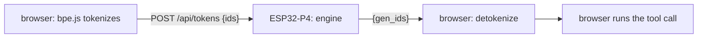

# MicroNeedle


[](https://github.com/psantillan/microneedle/actions/workflows/verify.yml)

A 26M function-calling model running on an ESP32-P4. It answers in ~3 seconds
from a ~$40 board that also serves its own demo page. You type a request in a
browser; the model picks one of the offered tools, fills in its arguments, and
the browser executes it. Routing is a measured copy mechanism: rename a tool
in the schema and the model emits the new name.

The model is [Cactus Compute's Needle](https://github.com/cactus-compute/needle),
the 26M "v3" checkpoint. It is an encoder-decoder with 12 encoder layers,
8 decoder layers, `d_model` 512, and no feed-forward network. That is why
26M parameters fit in 14.66 MiB.
This repository is an independent C99 + RISC-V vector-assembly port of its
forward pass, the firmware that serves it, and the measurement harness.

## Results

| | |
|---|---|
| Demo round trip, retrieval-pruned prompt | **2.81 s** |
| Full six-tool prompt | 5.81 s cold, **5.6 s** with the warm schema cache |
| Prefill, 271 tokens | 5.41 s |
| Decode | **9–11 tokens/s** |
| Weights resident | **14.66 MiB** (int4 projections, int8 embedding) |
| Reference config (int16) | prefill 0.38 s @22 / 0.73 s @48 / 5.9 s @271 tokens, **8/8 fixtures token-identical** |

Engineering log: [`docs/notebook/`](docs/notebook/). Cache measurements:
[`bench/gemm/README.md`](bench/gemm/README.md). Per-head causal analysis:
[`docs/HEADS.md`](docs/HEADS.md).



## Quickstart, no hardware

Needs `cc`/`make` and Python 3 with numpy; `node` for the tokenizer gate.

```
git clone https://github.com/psantillan/microneedle && cd microneedle
tools/get_weights.sh                 # fetch + sha256-verify the .npk artifacts (see WEIGHTS.md)
./verify.sh                          # every host-side gate
python3 demos/ask.py "What's the weather in Oslo?"
```

Weights are distributed through GitHub Releases. `WEIGHTS.md` has provenance,
licenses and checksums. Building them yourself needs an upstream Needle
checkout *plus its checkpoint*, which upstream does not keep in git; the
Release download needs nothing.

## Quickstart, with the board

You need a Waveshare **ESP32-P4-WIFI6-POE-ETH** board, ESP-IDF 5.4.2, and
Ethernet.

```
. $IDF_PATH/export.sh
cd firmware && idf.py build && idf.py -p /dev/ttyACM1 flash
esptool.py --chip esp32p4 -p /dev/ttyACM1 -b 921600 \
    write_flash 0x210000 ../weights/needle_runa_g512.npk    # the demo model, ~4 min
```

Open the address the boot log prints and ask it
something. The page, tokenizer and vocabulary are served from the board's
flash; weather comes from wttr.in, lookups from Wikipedia, and one tool
reports the board's own uptime.

`idf.py flash` (not `app-flash`) is required the first time: it writes the
partition table that declares the weights region.

**Verifying the port** uses the base model and the acceptance fixtures:

```
esptool.py --chip esp32p4 -p /dev/ttyACM1 -b 921600 \
    write_flash 0x210000 ../weights/needle_v3_g512.npk
NE_REF=../weights/board_reference_i8.json python3 ../tools/run_board_fixtures.py  # 8/8 expected
```

The shipped firmware builds with `NE_PIE + NE_ATTN_I8 + NE_WARMSCHEMA`: int8
attention and a warm schema cache. "Byte-identical certification" means the
board's output token ids are compared byte-for-byte, three runs, against a
reference. For the int16 configuration that reference is the JAX oracle
itself. For shipped int8, the criterion is board-referenced: the board's own
stable output (`weights/board_reference_i8.json`), three-run self-consistency,
and a margin audit (`tools/margin_audit.py`). Measured over the
retrieval-pruned prompts the demo actually sends, the smallest top-2 logit
gap in 90 decision steps is 8.5 logits. On the full-schema acceptance
fixtures, four steps sit under 1.0 logit, and exactly one (a 0.0097-logit
gap) resolves differently on board fp32 — the documented divergence in the
board reference, because fp32 libm never promised cross-platform bit
equality.

## Call it from your own code

The board is an HTTP endpoint that speaks token ids:

```
POST /api/tokens   {"ids": [...]}  ->  {"gen_ids": [...], "enc_ms", "tok_ms", "path"}
GET  /api/status                   ->  uptime, memory, boot self-tests
```

`demos/ask.py` is the worked example: build a prompt, send ids, decode, run
the call. `web/needle.js` is the same in JavaScript. To build the firmware
without the web UI: `idf.py menuconfig` → Needle → serve web demo → off.

## Teaching it your own tools

The stock model routes unfamiliar tools unreliably. A fine-tune fixes that
in minutes on one GPU; `tools/finetune.sh` drives the loop; see [`docs/finetuning.md`](docs/finetuning.md).
`train/make_dataset.py` generated the shipped demo corpus and reads as a
template.

## Repository layout

| | |
|---|---|
| `engine/` | The whole forward pass in portable C99 + the vector kernels in RISC-V assembly. Builds unchanged for x86 and the P4. |
| `firmware/` | ESP-IDF app: Ethernet, HTTP, the model, boot self-tests. |
| `web/` | The demo page and browser tokenizer, embedded into the firmware. |
| `demos/` | Drive it from your own code. |
| `tokenizer/` | BPE + vocabulary; one source of truth for host, browser and demos. |
| `tools/` | Pack weights, run gates, measure margins, fine-tune driver. |
| `train/` | Dataset generator for your own tools. |
| `test/` | The eight acceptance cases. |
| `weights/` | Reference oracle files; packed `.npk` artifacts land here (gitignored, fetched via `tools/get_weights.sh`). |
| `bench/` | Standalone measurements. Each subdirectory's README carries its numbers. |
| `docs/` | `docs/notebook/` (the engineering log), `docs/finetuning.md`, `docs/HEADS.md`. |

