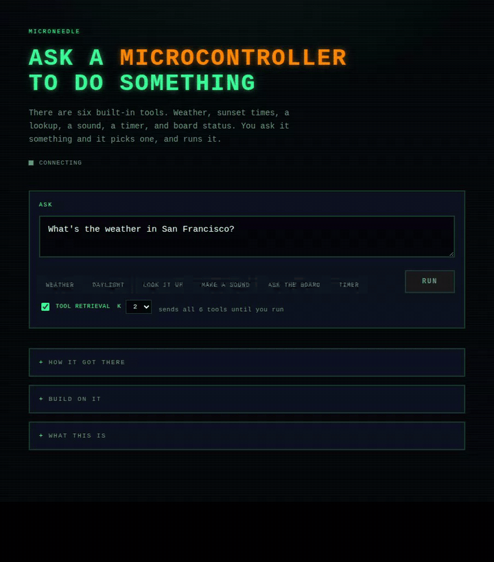
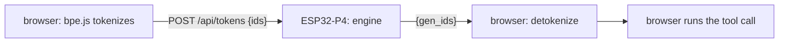

# MicroNeedle


<!-- TODO-CI-BADGE: ./verify.sh host gates, green on every push -->

A complete function-calling model answering in ~3 seconds from a ~$40
microcontroller board that also serves its own demo page. You type a request
in a browser; a 26M-parameter model running on the ESP32-P4 picks one of the
offered tools, fills in its arguments, and your browser executes it. The
routing is a measured copy mechanism, not memorization: rename a tool in the
schema and the model emits the new name — it routes tools it never saw in
training.

The model is [Cactus Compute's Needle](https://github.com/cactus-compute/needle) (the 26M "v3" checkpoint; port tracks upstream commit ffb1c51 — upstream has since released Needle 2, a different architecture):
an encoder–decoder "Simple Attention Network" — 12 encoder layers, 8 decoder
layers, `d_model` 512, **no feed-forward network anywhere** — which is why 26M
parameters fit in 14.66 MiB and do useful tool routing on a microcontroller.
This repository is an independent C99 + RISC-V vector-assembly port of its
forward pass, the firmware that serves it, and the measurement harness that
keeps every claim honest.

## Results (shipped configuration, measured on the board)

| | |
|---|---|
| Demo round trip, retrieval-pruned prompt | **2.81 s** |
| Full six-tool prompt | 5.81 s cold, **5.6 s** with the warm schema cache |
| Prefill, 271 tokens | 5.41 s ("prefill" = reading the prompt before the first output token) |
| Decode | **89–108 ms/token** |
| Weights resident | **14.66 MiB** (int4 projections, int8 embedding) |
| Reference config (int16) | prefill 0.38 s @22 / 0.73 s @48 / 5.9 s @271 tokens, **8/8 fixtures token-identical** |

How we know: the full engineering log lives in [`docs/notebook/`](docs/notebook/),
the cache-behavior measurements in [`bench/gemm/README.md`](bench/gemm/README.md),
and the per-head causal analysis in [`docs/HEADS.md`](docs/HEADS.md).



## Quickstart, no hardware

Needs `cc`/`make` and Python 3 with numpy; `node` for the tokenizer gate.

```
git clone <this repo> && cd <repo-dir>
tools/get_weights.sh                 # fetch + sha256-verify the .npk artifacts (see WEIGHTS.md)
./verify.sh                          # every host-side gate
python3 demos/ask.py "What's the weather in Oslo?"
```

Weights are distributed through GitHub Releases — `WEIGHTS.md` has provenance,
licenses and checksums. Building them yourself needs an upstream Needle
checkout *plus its checkpoint*, which upstream does not keep in git; the
Release download needs nothing.

## Quickstart, with the board

You need a Waveshare **ESP32-P4-WIFI6-POE-ETH** (dual RISC-V @ 360 MHz, 32 MB
flash, 32 MB PSRAM — a development board, not a $3 part), ESP-IDF 5.4.2, and
Ethernet.

```
. $IDF_PATH/export.sh
cd firmware && idf.py build && idf.py -p /dev/ttyACM1 flash
esptool.py --chip esp32p4 -p /dev/ttyACM1 -b 921600 \
    write_flash 0x210000 ../weights/needle_runa_g512.npk    # the demo model, ~4 min
```

Open `http://<board-ip>/` (the boot log prints the address) and ask it
something. The page, tokenizer and vocabulary are served from the board's
flash; weather comes from wttr.in, lookups from Wikipedia, and one tool
reports the board's own uptime.

`idf.py flash` (not `app-flash`) is required the first time: it writes the
partition table that declares the weights region.

**Verifying the port** uses the base model and the acceptance fixtures:

```
esptool.py --chip esp32p4 -p /dev/ttyACM1 -b 921600 \
    write_flash 0x210000 ../weights/needle_v3_g512.npk
NE_REF=../weights/board_reference_i8.json python3 ../tools/run_board_fixtures.py  # 8/8 expected
```

The shipped firmware builds with `NE_PIE + NE_ATTN_I8 + NE_WARMSCHEMA`: int8
attention and a warm schema cache. "Byte-identical certification" means the
board's output token ids are compared byte-for-byte, three runs, against a
reference. For the int16 configuration that reference is the JAX oracle
itself. For shipped int8, the criterion is board-referenced: the board's own
stable output (`weights/board_reference_i8.json`), three-run self-consistency,
and a margin audit (`tools/margin_audit.py`): measured over the
retrieval-pruned prompts the demo actually sends, the smallest top-2 logit
gap in 90 decision steps is 8.5 logits. On the full-schema acceptance
fixtures, four steps sit under 1.0 logit, and exactly one (a 0.0097-logit
gap) resolves differently on board fp32 — the documented divergence in the
board reference, because fp32 libm never promised cross-platform bit
equality.

## Call it from your own code

The board is an HTTP endpoint that speaks token ids:

```
POST /api/tokens   {"ids": [...]}  ->  {"gen_ids": [...], "enc_ms", "tok_ms", "path"}
GET  /api/status                   ->  uptime, memory, boot self-tests
```

`demos/ask.py` is the worked example — build a prompt, send ids, decode, run
the call. `web/needle.js` is the same in JavaScript. To build the firmware
without the web UI: `idf.py menuconfig` → Needle → serve web demo → off.

## Teaching it your own tools

The stock model routes unfamiliar tools unreliably — it is 26M parameters. A
fine-tune fixes it, takes minutes on one GPU, and `tools/finetune.sh` drives
the whole loop; see [`docs/finetuning.md`](docs/finetuning.md).
`train/make_dataset.py` generated the shipped demo corpus and reads as a
template.

## Repository layout

| | |
|---|---|
| `engine/` | The whole forward pass in portable C99 + the vector kernels in RISC-V assembly. Builds unchanged for x86 and the P4. |
| `firmware/` | ESP-IDF app: Ethernet, HTTP, the model, boot self-tests. |
| `web/` | The demo page and browser tokenizer, embedded into the firmware. |
| `demos/` | Drive it from your own code. |
| `tokenizer/` | BPE + vocabulary; one source of truth for host, browser and demos. |
| `tools/` | Pack weights, run gates, measure margins, fine-tune driver. |
| `train/` | Dataset generator for your own tools. |
| `test/` | The eight acceptance cases. |
| `weights/` | Reference oracle files; packed `.npk` artifacts land here (gitignored, fetched via `tools/get_weights.sh`). |
| `bench/` | Standalone measurements — each subdirectory's README carries its numbers. |
| `docs/` | `docs/notebook/` (the engineering log), `docs/finetuning.md`, `docs/HEADS.md`. |

## Hardware constraints (measured, binding)

- **`esp.vld.128` requires 16-byte alignment** — it mis-loads *silently*
  otherwise; use `heap_caps_aligned_alloc(16, ...)` for anything the vector
  unit reads.
- **IDF 5.4.2's lazy PIE context save is broken** (`portasm.S` skips `q3`),
  so inference runs with the scheduler suspended, per vector burst.
- A second core adds ~1.3× aggregate PSRAM bandwidth, not 2× (`bench/dualcore/`).
- Flash is 32 MB (GigaDevice; needs `CONFIG_SPI_FLASH_SUPPORT_GD_CHIP=y`);
  PSRAM runs at 200 MHz only behind `CONFIG_IDF_EXPERIMENTAL_FEATURES=y`.
- Flashing another IDF project replaces the partition table and orphans the
  weights blob; full `idf.py flash` restores it.

## Model semantics that break naive ports

All verified against the reference; the first three produce fluent, confident,
*wrong* output rather than a crash:

1. Cross-attention gets **no** RoPE; every other attention path does.
2. Per-head q/k norms come **before** the GQA repeat, before RoPE.
3. Norm weights apply as `(1 + w)`; residual gates as `sigmoid(g)`.
4. RoPE is half-split (dims 0–31 against 32–63), theta 10000.
5. Embedding lookups scale by `sqrt(512)` on encoder and decoder.
6. The embedding is tied and stored once: encoder input, decoder input, and
   (transposed) the output projection.
7. The encoder has a final norm; the decoder has its own, before logits.
8. Upstream `encode()` returns a *tuple* of (output, mask).

## Limitations

- **Eight fixtures are a smoke test, not a benchmark.** They prove the port
  reproduces the reference; they say little about model quality.
- One user at a time: inference holds the CPU per vector burst; this is not a
  server.
- Tokenization is not on the chip — the board speaks token ids; the tokenizer
  runs in the browser or on the host, both gated against the oracle.
- `NE_MAX_ENC` is 384 tokens and `NE_MAX_GEN` 64, compile-time.
- The engine holds one model in file-scope state; not reentrant.
- The fixtures record what the *model* does, quirks included — one fixture
  answers `"mains power"` where the tool wants `"mains"`.
- The parity oracle uses group-32 fake-quantized weights while the shipped
  artifact is group-512: the board is scored against a slightly stricter
  reference than itself.

## Attribution and license

MIT, see `LICENSE`; third-party notices in `THIRD_PARTY_NOTICES.md`; weight
provenance and licenses in `WEIGHTS.md`.

The Needle model, reference implementation and vocabulary are the work of
[Cactus Compute](https://github.com/cactus-compute/needle) (MIT).
`tokenizer/vocab.txt` derives from theirs. This is an independent port, not
affiliated with or endorsed by them.
